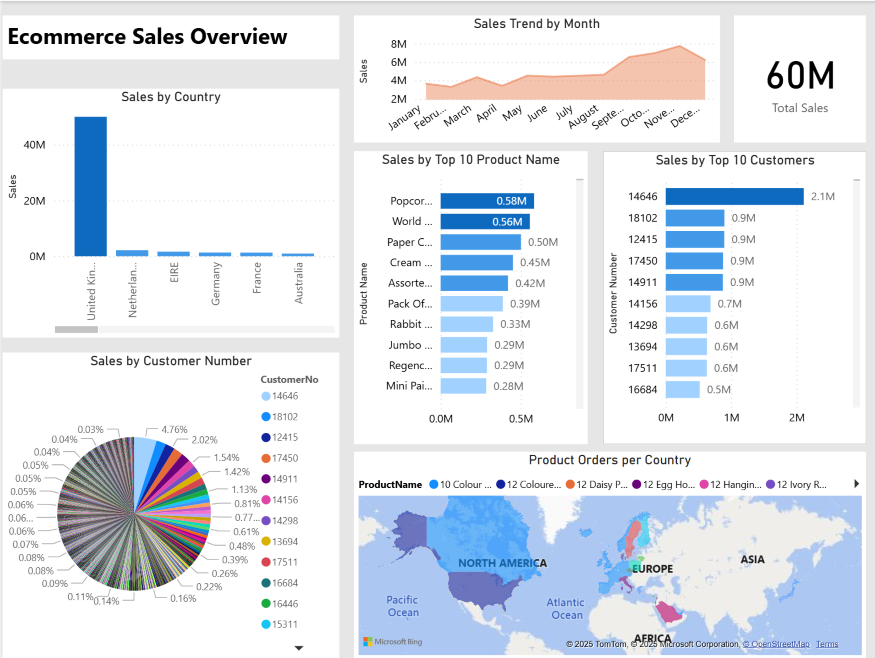

# Power BI E-commerce Sales Transactions 

## Overview
The project covers creating Power BI Dashboard and Reports for analyzing sales performance and distribution across products and regions for an e-commerce dataset. 

The analysis uses the Kaggle [E-commerce Sales](https://www.kaggle.com/datasets/gabrielramos87/an-online-shop-business/data) dataset, a sales transaction data of UK-based e-commerce (online retail) for one year. The dataset contains 536350 records and 8 attributes. After importing the company’s sales data into Power BI, I used Power Query Editor to clean and organize fields and do further transformations.

## Data Analysis
When creating visualizations for Dashboard, Sales. Product and Customer Reports, I looked for answers to the following questions:

1. How was the sales trend over the months?
2. What are the most frequently purchased products?
3. How was the sales amount by country?
4. What are the most profitable segment customers?

## Visualizations:
-	Area chart for tracking sales trends, to spot seasonality and growth patterns over time
-	Stacked bar charts to uncover top customers and topmost products
-	For a global view, used a filled world map of product orders per country
-	Pie chart of sales by customers to visualize the strong performers
-	Sales by country  using a stacked column chart
-	Yearly sales amount using a pie chart
-	Gauge of the average sales per customer

The dashboard focuses on sales trends, performance of the products and regions, and discovering the most profitable segment customers. It offers an easy way to view the most important KPI’s and results at a glance.

 

The Dashboard was created using visuals from Sales, Products and Customer reports, which show the most important trends and figures. Using the dashboard and the reports, we can monitor results and progress. By immediately having the right information available, correct decisions can be made.

### Dataset
The analysis uses the Kaggle [E-commerce Sales](https://www.kaggle.com/datasets/gabrielramos87/an-online-shop-business/data) dataset, a sales transaction data of UK-based e-commerce (online retail) for one year. The dataset contains 536350 records and 8 attributes.

### Preparation
I imported the company’s sales data into Power BI, then used Power Query Editor to clean and organize fields and do further transformations.

### Data Analysis
When creating visualizations for Dashboard, Sales. Product and Customer Reports, I looked for answers to the following questions:

1. How was the sales trend over the months?
2. What are the most frequently purchased products?
3. How was the sales amount by country?
4. What are the most profitable segment customers?

### Visualizations:
-	Area chart for tracking sales trends, to spot seasonality and growth patterns over time
-	Stacked bar charts to uncover top customers and topmost products
-	For a global view, used a filled world map of product orders per country
-	Pie chart of sales by customers to visualize the strong performers
-	Sales by country  using a stacked column chart
-	Yearly sales amount using a pie chart
-	Gauge of the average sales per customer
